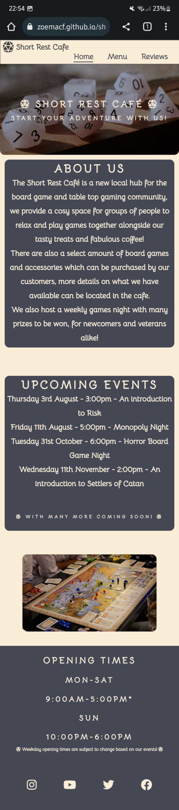
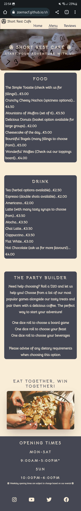
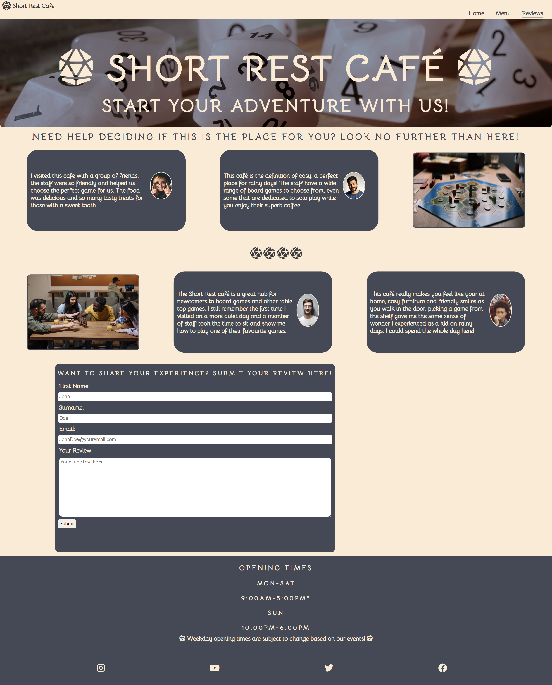
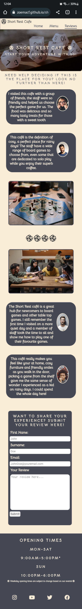
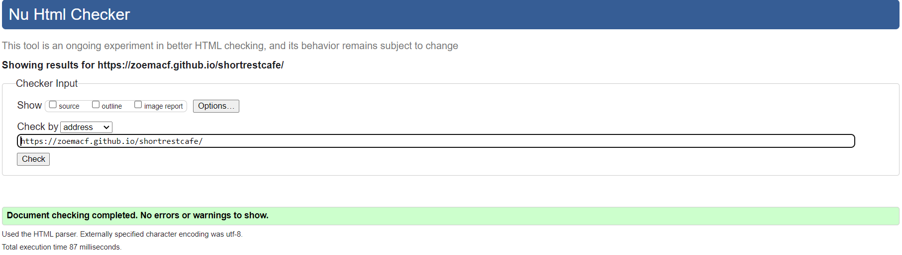

# Short Rest Cafe

Short Rest Café website is a hub for people to learn about their local board game café, there is also a review section for the café along with a menu.

The live site can be viewed here [Short Rest Cafe](https://zoemacf.github.io/shortrestcafe/)

## Contents

* [User Experience](#user-experience-ux)
  * [User Stories](#user-stories)

* [Design](#design)
  * [Typograhpy](#typography)
  * [Imagery](#imagery)
  * [Wireframes](#wireframes)

* [Technologies Used](#technologies-used)

* [Features](#features)

## User Experience (UX)

### Initial Discussion

The Short Rest Cafe is a place for board game enthusiasts to meet up, indulge in coffee and treats alongside their favourite board games.

### User Stories

#### First Time Visitor Goals

- I want to be able to easily understand the purpose of this website and learn about the cafe. 
- I want to learn more about board games and other table top games.
- I want to easily locate the cafe's opening times

#### Returning Visitor Goals

- I want to easily be able to navigate the website and access its features such as the menu
- I want to know when there are any upcoming events.
- I want to be able to submit a review of my experience at the cafe. 

#### Frequent Visitor Goals

- I want to be able to use the website across multiple devices without too much difference in the site content. 

## Design

### Typography

The font family Bellota was chosen for the website as it was a nice simple and minimalistic font but it also suited the theme of the cafe, a sort of whimsical cafe. 

### Imagery

- An image of geometric dice, also known as D20s was chosen to be the hero image for this website to help catch the user's eye, but it also helped to decide on the colour theme for the website itself and a reoccuring theme of using a d20 dice (provided by Font Awesome) to break up parts of the website. 

- A range of images were chosen for this site, I wanted to use images which displayed various board games being played and with groups of people to show a community feeling to the cafe.

### Short Rest Color Scheme

The initial colour scheme for this site was to go with various shades of blue, however when the hero image was chosen I wanted to choose colours which would really compliment since it would be used across all three pages. This is when I decided to go with charcoal (#444955) for all of the containers alongside antique white (#FAEBD7) for the text and headings, it was also used for the background to make all the elements pop. 

### Wireframes

#### Home

The initial design for the home page was to include an about us section alongside a selection of photos. 

However whilst working on the design I felt it suited the purpose of the site to have an 'About Us' section alongside an 'Upcoming Events' section. Both of these areas create help to show that the cafe is a place for everyone with many community events. 

The final image chosen helped give an introduction to the board game theme of the cafe. 

#### Menu

For the menu page I had planned on having a section for food, drink and then a selection of board games. This then changed to just food and drink, however I felt the site lacked a suitable feature here and decided to include a section where customers can interact with the staff in a fun way to help decide on the board game they should play alongside food and drink. 

#### Gallery

During the planning phase of this site I had planned on creating a gallery page, however as progress on the site moved along I felt that it did not fit with my idea of the site and decided to take it out. 

#### Reviews

And finally for the reviews page I planned on having some reviews on board games to help customers decide on what to play. This was then changed to four reviews about how it felt to visit the cafe alongside two images of people playing board games together. 

## Final Design

### Home 

#### Desktop Version

#### Mobile Version

### Menu 

#### Desktop Version

#### Mobile Version

### Reviews 

#### Desktop Version

#### Mobile Version

### Form Submission Page

#### Desktop Version

A submission page was created to be displayed to the user upon completion of their review, however this custom .html page did not work on the live site as PHP was needed, this may be implemented in the future to tie in with the overall look of the site. 

### Features
This website is made up of three pages, all of these are accesible from the navigation menu (home, menu and reviews).

#### Main content on each page:

  * Navigation Bar
    - The navigation bar contains links to the home, menu and reviews page. 
    - The menu is set as a sticky header, this allows ease of access for the user throughout the page. 

    

  * Hero Image 
    - Each page contains a hero image with a title 'Short Rest Cafe' along with a tagline 'Start Your Adventure With Us!' 
    - This hero image helps set the theme and overall design of the website. 

    

  * Footer 
   - The bottom of each page contains the site footer, which has links to various social media outlets through icons. 
   - It also contains the opening hours for the cafe. 

   
   
### Accessibility

## Technologies Used

- #### [Font Awesome](https://fontawesome.com/)
  The icons used throughout this website were all sourced from Font Awesome.
  
- #### [Balsamiq](https://balsamiq.com/wireframes/?gclid=Cj0KCQiA14WdBhD8ARIsANao07g6CkndNmxQPlHP92mM3VQBwb6lbQIg5FPinhmNFxWsAnM7BpA_PukaAldMEALw_wcB)
  Balsamiq was used to help create the intial design for the websites layout.
  
- #### [Google fonts](https://fonts.google.com/knowledge)
  The font family 'Bellota' was sourced and imported through Google Fonts.

- #### [GIMP] (https://www.gimp.org/)
  This free photo editing software was used to resize images whilst retaining quality.

- #### [Codeanywhere] (https://app.codeanywhere.com/)
  Codeanywhere was used to code the website.
  
  

### Languages Used

- The main structure of the website was created using HTML.
- The styling of the website was created with CSS.

## Deployment & Local Development

### Deployment

This website was created using Codeanywhere and pushed to GitHub under the repository name 'shortrestcafe'.

GitHub pages was then used to deploy the live version of the site, the following instructions for this can be found below:

1. Log in to GitHub account (or sign up if there is no account)
2. Locate the repository for the project, 'shortrestcafe'
3. Access the settings page.
4. In the navigation bar on the lefthand side choose the link for Pages.
5. When choosing a source, choose the main branch from the drop down menu, and select root from the folder name. 
6. Finally click Save, the live GitHub page for your site will then been deployed.

### Local Development

#### How to Fork

In order to fork the repository the following must be done:

1. Log into your GitHub account or create one. 
2. Locate the repository for this project under, ZoeMacf/shortrestcafe/
3. Finally, click the fork button in the top right corner.

#### How to Clone

In order to clone the repository for local development you will need to follow the below:

1. Log into your GitHub account. 
2. Go to the repository for this project at ZoeMacf/shortrestcafe/
3. Next you will need to click on the green '<> Code' button and then choose your preferred method.
4. Access the terminal in your code editor, create a new directory that you would like to use for the clone. 
5. Then type 'git clone' into your code editor's terminal, paste the link from step 3 and hit enter. 

## Testing

### W3C Validator

[W3C](https://validator.w3.org/nu/) was used in order to test the HTML across all three pages for the website. 

The HTML validation process used on this website passed. 

### Jigsaw CSS Validator

For the CSS used across the website, [Jigsaw](https://jigsaw.w3.org/css-validator/) was used as a validation tool. 

The CSS validation process used on this website passed. 

### Lighthouse 

Chrome's lighthouse developer tool was used to check the performance of each page across the Short Rest Cafe site. All of the parameters checked by lighthouse gave high results however the initial loading of each page was slowed down by the hero-image. The final results are as follws: 

#### Index Page

#### Menu page

#### Reviews page

### Further Testing

Full testing of the functionality of the site was done on the following devices:

- Laptop Used : HP EliteBook 8570w
- Mobile : Samsung S21 Plus

The following browsers were used to test the functionality of the site. 

* Google Chrome
* Firefox
* Safari (Emulated through Browserstacks)

| Feature Tested  | Outcome  | Test Performed  | Result  | Pass/Fail  |
|---|---|---|---|---|
| `Navigation`  |   |   |   |   |
| Home Page Link  |  When the link is clicked it should direct the user to the 'Home' page | Click on 'Home' text on navbar  | Redirects to 'Home' Page  | Pass  |
|  Menu Page Link | When the link is clicked it should direct the user to the 'Menu' page   | Click on 'Menu' text on navbar  |  Redirects to 'Menu' Page | Pass |
| Reviews Page Link  | When the link is clicked it should direct the user to the 'Reviews' page  | Click on 'Reviews' text on navbar  | Redirects to 'Reviews' Page  | Pass  |
|  `Footer` |   |   |   |   |
|  Instagram Link | When the link is clicked it open a link to Instagram in a new tab  |  Click on 'Instagram' icon | A new tab opens and directs to Instagram  | Pass |
| YouTube Link  | When the link is clicked it open a link to YouTube in a new tab  | Click on 'YouTube' icon  |  A new tab opens and directs to YouTube | Pass  |
|  Twitter Link | When the link is clicked it open a link to Twitter in a new tab  | Click on 'Twitter' icon  | A new tab opens and directs to Twitter  | Pass  |
|  Facebook Link | When the link is clicked it open a link to Facebook in a new tab  | Click on 'Facebook' icon  | A new tab opens and directs to Facebook  | Pass  |
| `Menu Page`   |   |   |   |   |
|  Gallery Wrapper | Should change image when clicking on small white circles  | Click on white circle  |  Image changes | Pass  |
| Gallery Wrapper  |  Should slide through images when using touchpad on laptop | Slide mouse along image using touchpad  |  Images change | Pass  |
| `Reviews Page`  |   |   |   |   |
| Review submit button | Should not allow review to be submitted if all or none of the fields are filled in  | Click submit button  | A pop-up saying 'Please fill out this field' appears to the user  | Pass  |
|  Revews form 'email' field | Should not accept any input unless it is an email address  | Enter a value without '@'  |  A pop-up appears saying 'Please include an '@' in the email address | Pass  |
| Reviews Submission Form  | Should submit values entered and display form dump page  | Values are entered for all fields and submit button clicked | Form Dump page is displayed  | Pass  |